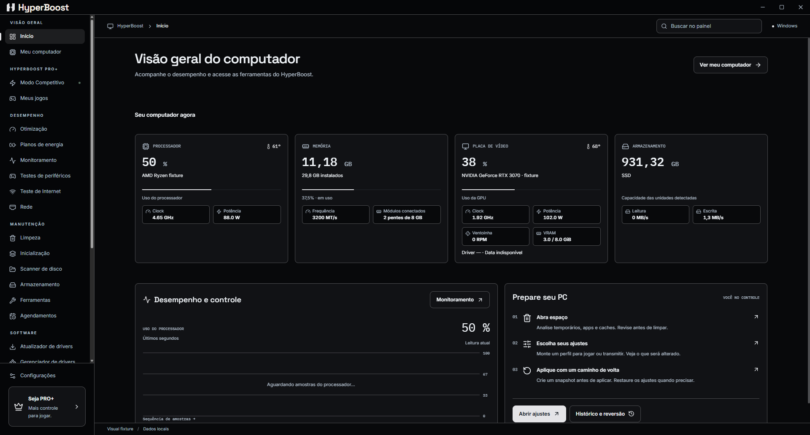

  
  <h1>HyperBoost</h1>
  
<strong>Otimize, limpe e cuide do seu Windows com ferramentas avançadas e gratuitas.</strong>

  
Um otimizador para Windows que reúne limpeza, diagnóstico e revisão de segurança. Com o HyperBoost PRO+, tenha mais controle sobre ajustes competitivos e perfis de jogos.

  
<strong>Windows</strong> · Limpeza · Diagnóstico · Segurança · Jogos

  
<a href="#visao-geral">Visão geral</a> · <a href="#hyperboost-pro">Conheça o HYPERBOOST PRO+</a> · <a href="https://github.com/brundevs/HyperBoost/issues/new?template=improvement.yml">Sugira melhorias</a> · <a href="https://github.com/brundevs/HyperBoost/issues/new?template=bug.yml">Reporte um problema</a> · <a href="https://www.instagram.com/hyperboost.app/">Instagram</a> · <a href="https://www.tiktok.com/@hyperboost.app">TikTok</a>

Interface da versão em desenvolvimento. Dados ilustrativos, sem informações pessoais.

## Seu computador, com mais controle

O HyperBoost é um otimizador para Windows que reúne ferramentas de manutenção, diagnóstico e configuração em um único painel. Veja o que está acontecendo, revise as alterações e preserve um caminho de volta.

| O que você quer fazer? | Como o HyperBoost ajuda |
| --- | --- |
| **Liberar espaço e organizar arquivos** | Limpeza do sistema, análise de disco e ferramentas para encontrar duplicados, arquivos grandes e pastas vazias. |
| **Entender o desempenho do PC** | Inventário de hardware, sensores reais e acompanhamento de processador, memória, GPU e atividade das unidades. |
| **Revisar a segurança do Windows** | Consulte configurações e recursos de proteção do sistema, com disponibilidade e estados apresentados para revisão. |
| **Conhecer sua conexão e seus periféricos** | Teste de Internet com velocidade, latência e avaliações explicativas; testes de teclado, mouse, controle, áudio e monitor. |
| **Revisar e recuperar alterações** | Histórico, backups e ferramentas de recuperação para as operações que oferecem restauração. |

**Comece pelas ferramentas gratuitas. Vá além com os recursos competitivos do PRO+.**

## Mais controle para jogar com HyperBoost PRO+

Prepare seu ambiente de jogo com ajustes que você pode revisar e perfis organizados em um só lugar.

| Incluído no PRO+ | O que oferece |
| --- | --- |
| **Modo Competitivo** | Ajustes de sistema e de rede para jogos competitivos, com opções compatíveis com o hardware, aplicação individual ou em lote e confirmação antes das alterações. |
| **Meus jogos** | Perfis de jogos e organização dos executáveis, com configurações por jogo e ações apresentadas para revisão. |

  <h3>HYPERBOOST PRO+ · R$ 19,90/mês</h3>
  
<strong>Mais controle para jogar. Otimize seu PC para buscar mais FPS e estabilidade nos jogos.</strong>

  
<strong>Assinaturas em breve</strong>

  
<a href="https://github.com/brundevs/HyperBoost/discussions/categories/announcements">Acompanhe as novidades e o lançamento</a>

Uma assinatura permite **um computador ativo**, com transferência explícita da ativação. A autorização offline dura **até 72 horas**, sem ultrapassar o período pago. O acesso será validado pela conta Google ou Discord quando os serviços estiverem disponíveis. Histórico, backups e recuperação permanecem acessíveis após o vencimento.

## Ajude o HyperBoost a evoluir

**Gostou da proposta? Dê uma estrela no topo da página e acompanhe o projeto.** Seu feedback ajuda a orientar as próximas versões.

- [Sugira uma melhoria](https://github.com/brundevs/HyperBoost/issues/new?template=improvement.yml)
- [Reporte um problema](https://github.com/brundevs/HyperBoost/issues/new?template=bug.yml)
- [Converse com a comunidade](https://github.com/brundevs/HyperBoost/discussions)
- [Acompanhe os anúncios](https://github.com/brundevs/HyperBoost/discussions/categories/announcements)
- [Siga no Instagram](https://www.instagram.com/hyperboost.app/)
- [Siga no TikTok](https://www.tiktok.com/@hyperboost.app)

Ao reportar um problema, informe a versão do HyperBoost e do Windows. Remova informações pessoais antes de anexar capturas ou relatórios.

## Disponibilidade e atualizações

Os resultados da otimização variam conforme hardware, configurações e jogo.

**Downloads ainda não estão disponíveis nesta página.** Instalador e portátil serão publicados em Releases após a validação correspondente. Consulte [como serão publicadas as versões](RELEASES.md).

Esta é a comunidade pública do HyperBoost. O código do aplicativo permanece privado. A versão em desenvolvimento é **0.6.23**; os provedores de login e assinatura ainda precisam ser configurados. A falha gráfica dos testes de monitor permanece aberta até a validação física. Capturas de desenvolvimento não indicam disponibilidade comercial.

## Licenças

HyperBoost é um software proprietário. Licenças e atribuições dos componentes utilizados acompanham o aplicativo. Este repositório público não concede licença sobre o código privado.
